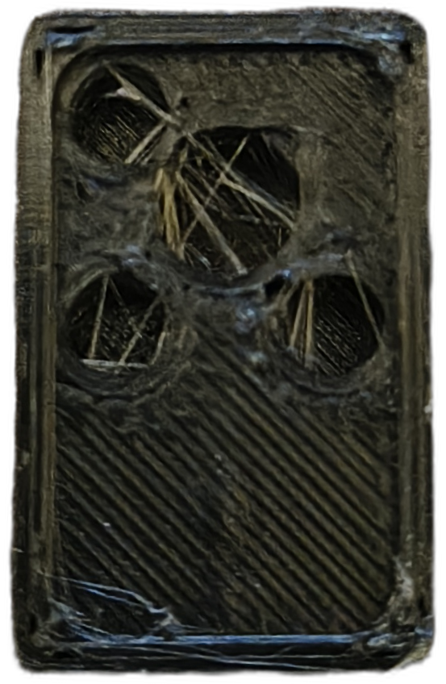
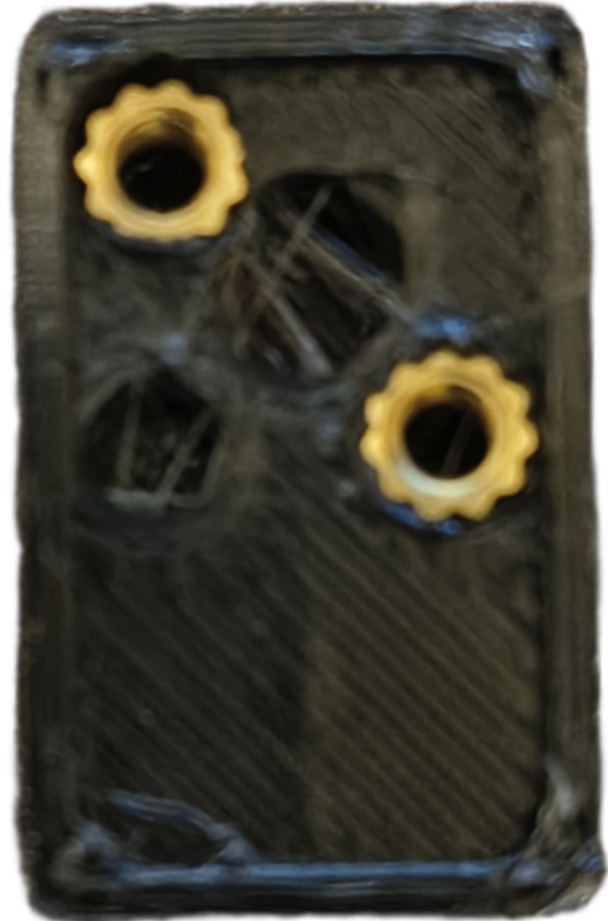
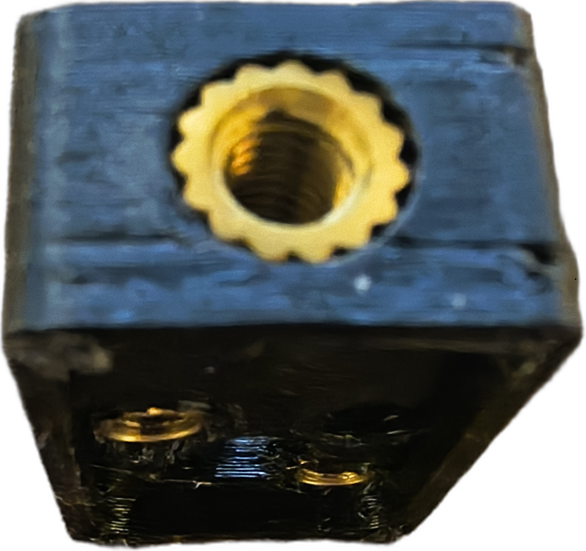

# Assembly
## Enclosure

### 3D Print

  

### Install heated inserts
<table style="border-collapse: collapse; border: none;">
  <tr>
    <td style="border: none; padding: 0 20px 0 0;">
       
      <b>Back</b>
    </td>
    <td style="border: none; padding: 0;">
       
      <b>Bottom</b>
    </td>
  </tr>
</table>

## PCB
### Ordering
Use the provided Gerber files to order the PCB.
The repository also contains an **untested PCB revision with optimized terminals**.

### Assembly
Populate the PCB with all required components.

### Wiring and Connectors
Connect the wires to V+, V−, BNC+, and BNC− on the PCB.
Solder the banana sockets to V+ and V−, and the BNC connector to BNC+ and BNC−.

## Testing
### Electrical Test
### Power-On Test
### Signal Test

