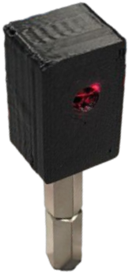
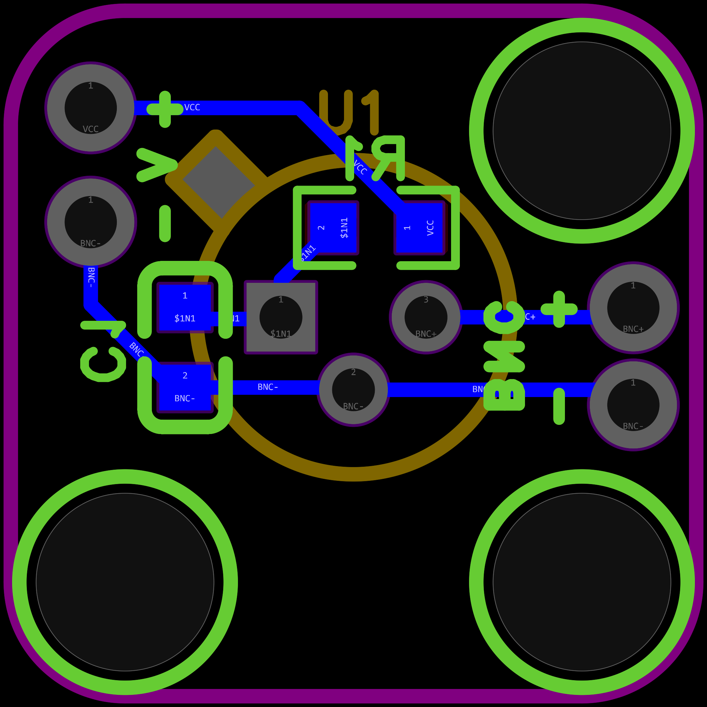

# open-tiny-biased-photodetector
A compact open-source biased photodetector with a custom PCB and 3D-printed enclosure.
The photodiode is operated with a reverse bias to improve its performance for high-speed optical detection.
The goal of this project is to provide a small, affordable and reproducible photodetector that can be built, modified and improved by others.
The design is an independent project and is not affiliated with, endorsed by, or a copy of any commercial photodetector.

The detector consists of three main parts:

Custom-designed PCB – contains the photodiode, and analog signal-conditioning electronics.
3D-printed enclosure – provides mechanical protection and houses the PCB.
Connectors – provide the electrical interface for power and signal output.

  

# Bill of Materials
| No. | Qty. | Designator | Value                     | Footprint             | Manufacturer Part     | Supplier Part | Supplier |
| :-: | :--: | :--------: | :------------------------ | :-------------------- | :-------------------- | :------------ | :------- |
|  1  |   1  |     C1     | 100 nF                    | 0603                  | —                     | -             | -        |
|  2  |   1  |     R1     | 1 kΩ                      | 0603                  | —                     | -             | -        |
|  3  |   1  |     U1     | Photodiode                | TO-18-3               | S5971 / S5972 / S5973 | -             | -        |
|  4  |   1  |     J1     | BNC female, bulkhead      | —                     | —                     | -             | -        |
|  5  |   1  |     J2     | 4 mm banana socket, red   | —                     | RS PRO 208-0246       | 208-0246      | RS       |
|  6  |   1  |     J3     | 4 mm banana socket, black | —                     | RS PRO 208-0245       | 208-0245      | RS       |
|  7  |   2  |      —     | Wire, red                 | —                     | —                     | —             | —        |
|  8  |   2  |      —     | Wire, black               | —                     | —                     | —             | —        |
|  9  |   2  |      —     | M3 heat-set insert        | —                     | Ruthex                | —             | —        |
|  10 |   1  |      —     | M4 heat-set insert        | —                     | Ruthex                | —             | —        |
|  11 |   1  |      —     | Enclosure                 | —                     | 3D-Printing           | —             | —        |
|  12 |   2  |      —     | Screw M3 × 5 mm           | —                     | —                     | —             | —        |

# Photodiode alternatives
The following photodiodes can be used as alternatives:
- Hamamatsu S5971
- Hamamatsu S5972
- Hamamatsu S5973

The PCB footprint is compatible with all three variants

# Development status
The current PCB revision is an updated version of the design and has not yet been experimentally tested.
The released files should therefore be considered a development revision until the updated PCB has been assembled and verified.
The previous tested design remains the reference for the currently verified hardware.

  

# Operation
## Bias Supply
The photodiode is operated in reverse-bias mode.
The detector is intended to be operated from a **9 V DC supply**.
Always observe the correct supply polarity and do not exceed the specified supply voltage.

## Output Termination
For high-speed measurements, a **50 Ω termination is required**.
The recommended measurement setup is: **Photodetector → 50 Ω coaxial cable → 50 Ω oscilloscope input / 50 Ω terminator**

The 50 Ω termination provides impedance matching and minimizes reflections and ringing in the measurement setup.

When using a high-impedance input such as a 1 MΩ oscilloscope input, the output voltage will be higher, but the electrical bandwidth and transient response will differ from the 50 Ω configuration.

For the intended high-speed operation, use a **50 Ω coaxial cable and a 50 Ω terminated measurement input**.

## Measurement Considerations
* Use a 50 Ω coaxial cable for high-speed measurements.
* Use a 50 Ω termination at the receiving end.
* Keep the signal cable as short as practical when high bandwidth is required.
* A high-impedance measurement input can be used for observing low-frequency or DC signals, but it should not be considered equivalent to the 50 Ω high-speed configuration.
* The photodiode is operated under reverse bias. Do not apply forward bias to the photodiode.
* The photodiode and PCB are ESD-sensitive. Take appropriate ESD precautions when assembling or handling the detector.

## Optical Safety
The detector itself does not generate optical radiation. However, it may be used with lasers or other potentially hazardous light sources.
Follow appropriate laser and optical safety procedures when operating the detector with hazardous optical sources.

# Performance
The current PCB revision has not yet been experimentally characterized.
Therefore, no verified performance specifications are currently provided for this revision, including:

- bandwidth
- rise time
- fall time
- noise
- responsivity
- maximum optical input power
- maximum output voltage

These values will be added after the PCB has been experimentally tested.
