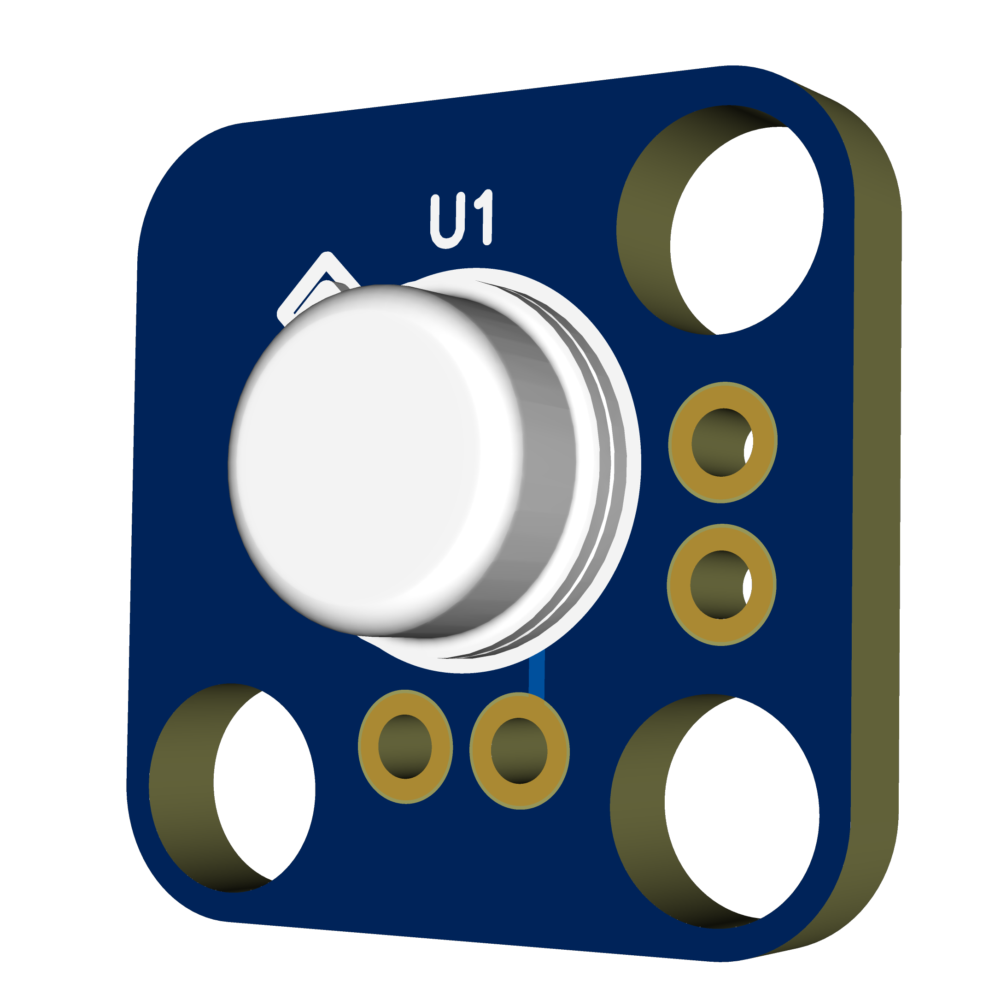
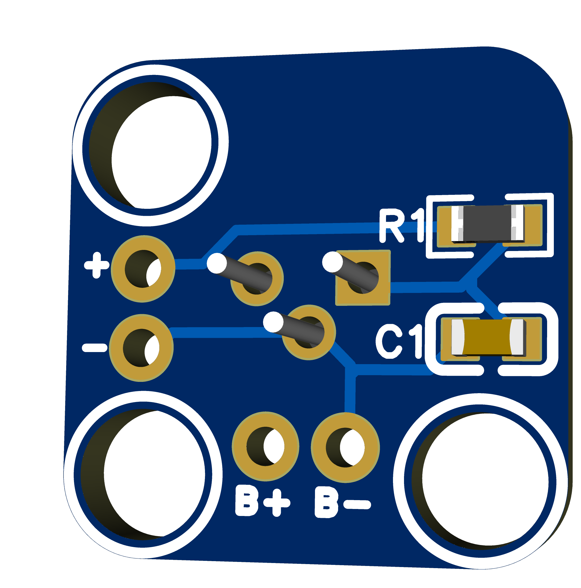

# Bill of Materials
| No. | Qty. | Designator | Value                     | Footprint             | Manufacturer Part     | Supplier Part | Supplier |
| :-: | :--: | :--------: | :------------------------ | :-------------------- | :-------------------- | :------------ | :------- |
|  1  |   1  |     C1     | 100 nF                    | 0603                  | —                     | -             | -        |
|  2  |   1  |     R1     | 1 kΩ                      | 0603                  | —                     | -             | -        |
|  3  |   1  |     U1     | Photodiode                | TO-18-3               | S5971 / S5972 / S5973 | -             | -        |
|  4  |   1  |     J1     | BNC female, bulkhead      | —                     | —                     | -             | -        |
|  5  |   1  |     J2     | 4 mm banana socket, red   | —                     | RS PRO 208-0246       | 208-0246      | RS       |
|  6  |   1  |     J3     | 4 mm banana socket, black | —                     | RS PRO 208-0245       | 208-0245      | RS       |
|  7  |   2  |      —     | Wire, red                 | —                     | —                     | —             | —        |
|  8  |   2  |      —     | Wire, black               | —                     | —                     | —             | —        |
|  9  |   2  |      —     | M3 heat-set insert        | —                     | Ruthex                | —             | —        |
|  10 |   1  |      —     | M4 heat-set insert        | —                     | Ruthex                | —             | —        |
|  11 |   1  |      —     | Enclosure                 | —                     | 3D-Printing           | —             | —        |

# Photodiode alternatives
The following photodiodes can be used as alternatives:
-Hamamatsu S5971
-Hamamatsu S5972
-Hamamatsu S5973
The PCB footprint is compatible with all three variants

### PCB

  
  &nbsp;&nbsp;
  

