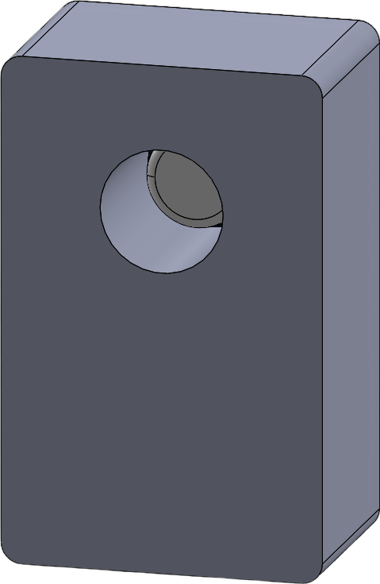
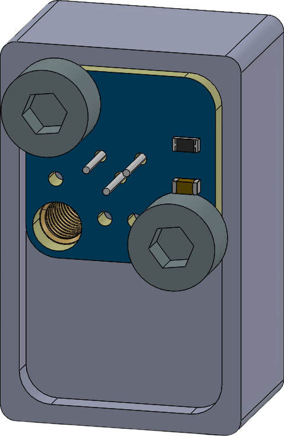

# Enclosure

  
  

## Assembly
The enclosure is intentionally designed to be as compact as possible. Due to the tight dimensions, some minor fitting and adjustment may be required during assembly.

### Fasteners
* **1× M4 threaded insert** — installed in the bottom of the enclosure
* **2× M3 threaded inserts** — two diagonal positions are sufficient
* **2× M3 × 5 mm screws**

### Fitting
Depending on the printer, material and printing tolerances, **some minor adjustment may be necessary**. If required, carefully use a **soldering iron** to slightly adjust individual areas of the printed enclosure and achieve a proper fit.
This is intentional and not a design error — the compact dimensions leave very little clearance.

## 3D Printed Parts
The enclosure is designed for **3D printing**. Actual dimensions and fit may vary depending on the printer, material, layer height and slicer settings.
